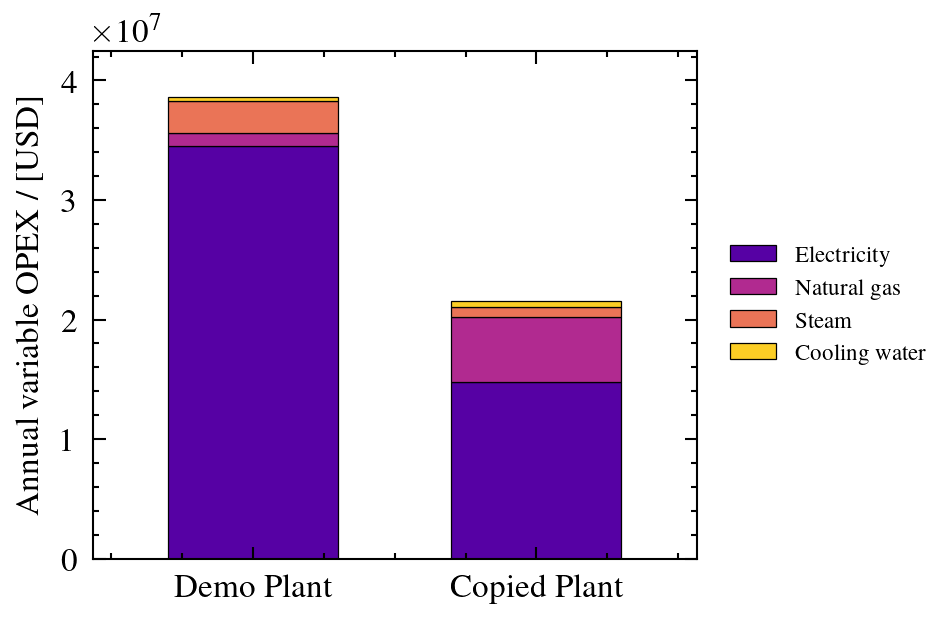
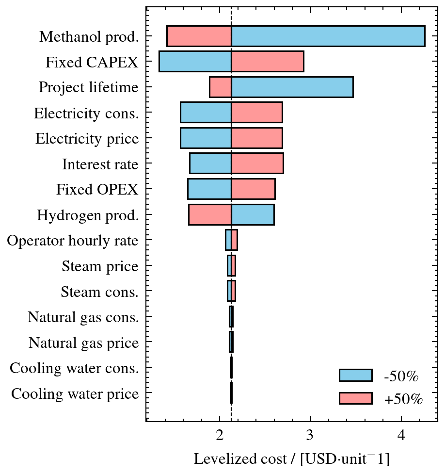
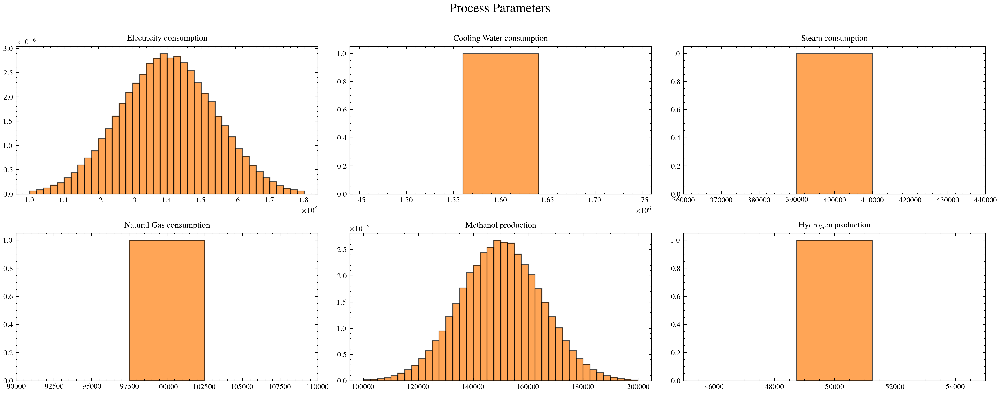
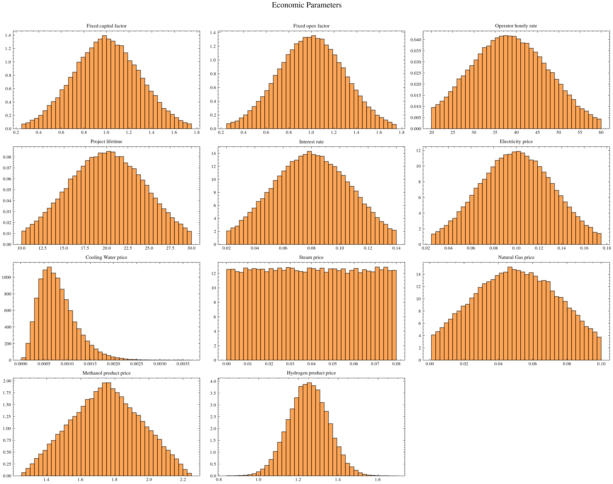
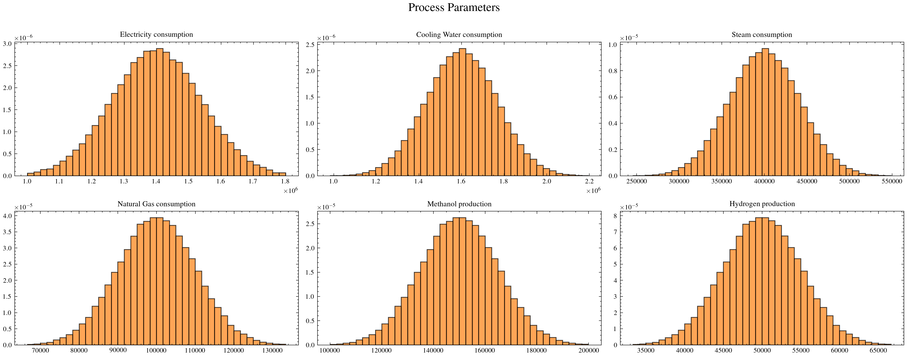
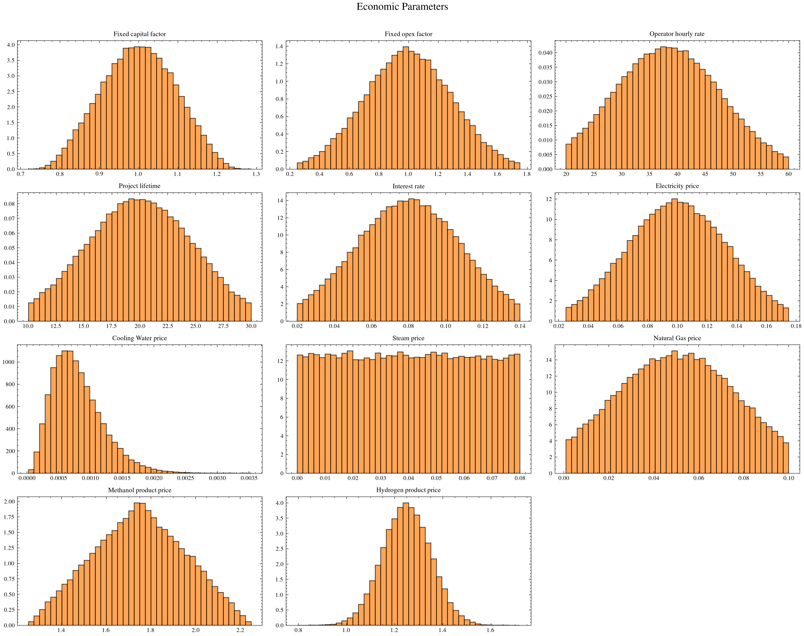
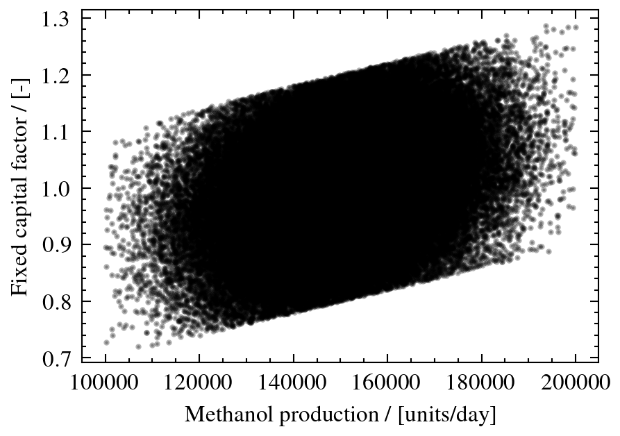
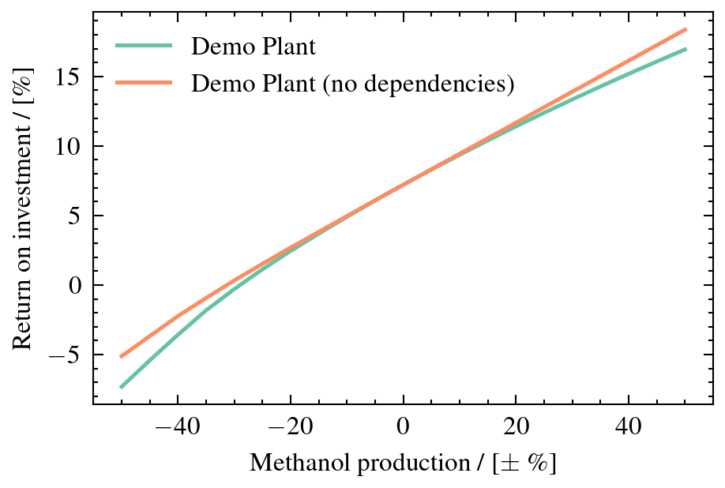

Analysis and Plotting
=====================

The :mod:`openpytea.analysis` module provides tools for understanding cost
structure and how uncertain inputs affect financial outcomes:

* **Cost breakdowns** — prepare equipment-level and plant-level CAPEX/OPEX data
* **Levelized cost breakdown** — split the LCOP into discounted CAPEX, OPEX, and side revenue
* **Cash flow diagram** — track a project's cumulative cash position over time
* **One-way sensitivity** — vary one parameter across a range and observe the metric
* **Tornado diagram** — rank all parameters by their ±impact on a single metric
* **Monte Carlo simulation** — propagate all uncertainties simultaneously

All analysis functions accept a configured and calculated
:class:`~openpytea.plant.Plant` object and return structured data. The
companion :mod:`openpytea.plotting` module renders that data: it wraps
matplotlib to produce publication-quality figures using the `SciencePlots
<https://github.com/garrettj403/SciencePlots>`_ style. Every plotting
function returns a ``(fig, ax)`` tuple — a :class:`matplotlib.figure.Figure`
and a :class:`matplotlib.axes.Axes` — so you can further customize or save
the figure directly (see :ref:`saving-figures` and :ref:`customizing-axes`
at the end of this page).

This two-step *data + plot* pattern runs through the whole page: an
analysis function prepares the numbers, a plotting function draws them.
The separation lets you reuse the data in custom visualizations or export
it directly.

To see the outputs of all code examples below, refer to the
walkthrough notebooks `Part 3: Cost Analysis and Sensitivity <https://github.com/pbtamarona/OpenPyTEA/blob/main/walkthrough/part_3_analysis.ipynb>`_ and `Part 4: Monte Carlo Uncertainty Analysis <https://github.com/pbtamarona/OpenPyTEA/blob/main/walkthrough/part_4_monte_carlo.ipynb>`_.

.. code-block:: python

   from openpytea.analysis import (
       direct_costs_data, fixed_capital_data,
       fixed_opex_data, variable_opex_data, levelized_cost_data,
       cash_flow_data, sensitivity_data, tornado_data, monte_carlo,
   )
   from openpytea.plotting import (
       plot_stacked_bar, plot_cash_flow, plot_sensitivity, plot_tornado,
       plot_monte_carlo, plot_monte_carlo_inputs, plot_multiple_monte_carlo,
   )

CAPEX and OPEX breakdowns
--------------------------

The five data-preparation functions and their outputs:

.. list-table::
   :header-rows: 1
   :widths: 35 65

   * - Function
     - Output
   * - ``direct_costs_data(plants)``
     - Equipment-level direct costs. A
       :class:`~openpytea.equipment.CompositeEquipment` is one segment by
       default; ``expand_composites=True`` splits it into its components
       (labelled ``"composite / component"``).
   * - ``fixed_capital_data(plants)``
     - ISBL, OSBL, D&E, contingency (and optional additional CAPEX).
   * - ``fixed_opex_data(plants)``
     - Each fixed OPEX component (absolute or as % of total).
   * - ``variable_opex_data(plants)``
     - Each variable OPEX item.
   * - ``levelized_cost_data(plants)``
     - Discounted CAPEX, OPEX, and side revenue per unit of main product.

Each of them feeds :func:`~openpytea.plotting.plot_stacked_bar`, which
draws a stacked bar chart of the breakdown. Basic usage (single plant):

.. code-block:: python

   # Equipment-level CAPEX
   direct_costs = direct_costs_data(plants=plant)
   fig, ax = plot_stacked_bar(direct_costs)

   # Same, with composite equipment split into its components
   direct_costs_split = direct_costs_data(plants=plant, expand_composites=True)

   # Fixed capital breakdown (ISBL, OSBL, D&E, Contingency;
   # include additional CAPEX events)
   fixed_capital = fixed_capital_data(plants=plant, additional_capex=True)
   fig, ax = plot_stacked_bar(fixed_capital)

   # Fixed OPEX as percentage of total
   fixed_opex = fixed_opex_data(plants=plant, pct=True)
   fig, ax = plot_stacked_bar(fixed_opex)

   # Variable OPEX by item
   variable_opex = variable_opex_data(plants=plant)
   fig, ax = plot_stacked_bar(variable_opex)

.. list-table::
   :widths: 50 50

   * - .. image:: ../_static/plotting/direct_costs.png
          :width: 100%
     - .. image:: ../_static/plotting/fixed_capital.png
          :width: 100%
   * - .. image:: ../_static/plotting/fixed_opex.png
          :width: 100%
     - .. image:: ../_static/plotting/variable_opex.png
          :width: 100%

Comparing multiple plants
~~~~~~~~~~~~~~~~~~~~~~~~~

Pass a list of :class:`~openpytea.plant.Plant` objects to compare two or
more configurations side-by-side; ``plot_stacked_bar()`` draws one bar per
plant:

.. code-block:: python

   from copy import deepcopy

   plant_b = deepcopy(plant)
   plant_b.update_configuration({
       "plant_name": "Scenario B",
       "variable_opex_inputs": {
           "electricity": {"consumption": 0.9e6, "price": 0.05},
       },
   })
   plant_b.calculate_all()

   variable_opex = variable_opex_data(plants=[plant, plant_b])
   fig, ax = plot_stacked_bar(variable_opex)

Levelized cost breakdown
--------------------------

:func:`~openpytea.analysis.levelized_cost_data` follows the same ``data`` +
``plot_stacked_bar()`` pattern as the CAPEX/OPEX breakdowns above, but
mirrors the discounting logic in
:meth:`~openpytea.plant.Plant.calculate_levelized_cost`: capital cost, cash
cost, side-product revenue, and production are each discounted over the
project lifetime at the plant's interest rate, then divided by discounted
production to express every component per unit of main product.

.. code-block:: python

   from openpytea.analysis import levelized_cost_data
   from openpytea.plotting import plot_stacked_bar

   lcop = levelized_cost_data(plants=plant)
   fig, ax = plot_stacked_bar(lcop)

.. image:: ../_static/plotting/levelized_cost.png
   :width: 260px
   :align: center

Side revenue is stored as a **negative** value (since it is subtracted from
the LCOP numerator), so the three components sum directly to the plant's
LCOP: ``CAPEX + OPEX + Side revenue = LCOP``. ``plot_stacked_bar()`` renders
it as a waterfall-style base below zero rather than stacking it like a
normal cost, so CAPEX and OPEX still stack up to the true net LCOP at the
top of the bar. The side-revenue segment reuses the color of the largest
stacked component, distinguished only by a hatch pattern, so the CAPEX/OPEX
ratio stays easy to read.

As with the other breakdowns, pass a list of plants to compare their LCOP
composition side-by-side, and ``pct=True`` to express components as a
percentage of the total instead of absolute values. Only the scalar
(non-Monte Carlo) case is supported — each plant's ``project_lifetime`` and
``interest_rate`` must be a single value, not a sampled array.

Cash flow diagram
--------------------------

:func:`~openpytea.analysis.cash_flow_data` prepares the data behind the
classic project cash flow diagram: cumulative cash position vs. time,
including the dip into debt during construction/start-up, the point of
deepest ("maximum") investment, the break-even (pay-back) point where the
curve first crosses back above zero, and the eventual climb into profit.
It (re)runs each plant's
:meth:`~openpytea.plant.Plant.calculate_cash_flow` to ensure the underlying
annual cash flow array is up to date.

:func:`~openpytea.plotting.plot_cash_flow` draws the curve. The region
where the cumulative cash flow is negative is shaded (hatched) as debt, and
the break-even point (if any) is marked with a dashed vertical line in the
same color as the curve.

.. code-block:: python

   from openpytea.analysis import cash_flow_data
   from openpytea.plotting import plot_cash_flow

   cash_flow = cash_flow_data(plant)
   fig, ax = plot_cash_flow(cash_flow)

   fig.savefig("cash_flow.pdf")

.. image:: ../_static/plotting/cash_flow.png
   :width: 450px
   :align: center

The returned dict has one entry per plant under ``"curves"``, each carrying
the cumulative curve itself (``"years"``, ``"cumulative"``) alongside the
derived figures ``"max_investment"``, ``"max_investment_year"``,
``"breakeven_year"`` (``None`` if the project never recovers), and its alias
``"payback_time"`` — useful for pulling numbers into a report without
re-deriving them from the curve:

.. code-block:: python

   curve = cash_flow["curves"][0]
   print(f"Max investment: {curve['max_investment']:,.0f} in year {curve['max_investment_year']:.0f}")
   print(f"Break-even: year {curve['breakeven_year']:.1f}")

Comparing multiple plants
~~~~~~~~~~~~~~~~~~~~~~~~~

Pass a list of plants to overlay their cumulative cash flow curves, each
with its own shaded debt region and break-even line, for direct
comparison:

.. code-block:: python

   cash_flow_multi = cash_flow_data([plant, plant_b])
   fig, ax = plot_cash_flow(cash_flow_multi, figsize=(4.5, 3))

.. image:: ../_static/plotting/cash_flow_multi.png
   :width: 450px
   :align: center

Only the scalar (non-Monte Carlo) case is supported; if a plant's
``cash_flow`` has multiple rows (vectorised inputs), the first row is used.

One-way sensitivity analysis
-----------------------------

:func:`~openpytea.analysis.sensitivity_data` varies a single parameter over
a symmetric range while holding everything else constant, then records the
selected metric at each point. :func:`~openpytea.plotting.plot_sensitivity`
draws the resulting curve; axis labels and the legend are set automatically
from the returned data.

.. code-block:: python

   from openpytea.analysis import sensitivity_data
   from openpytea.plotting import plot_sensitivity

   # Default metric is LCOP; vary electricity price ±50 %
   sens = sensitivity_data(plants=plant, parameter="electricity", plus_minus_value=0.5)
   fig, ax = plot_sensitivity(sens)

   fig.savefig("sensitivity.pdf")

   # Specify metric and label explicitly
   npv_sens = sensitivity_data(
       plants=plant,
       parameter="methanol",       # product price
       metric="NPV",
       plus_minus_value=0.5,
       label="Project A — NPV [USD]",
   )
   fig, ax = plot_sensitivity(npv_sens)

.. list-table::
   :widths: 50 50

   * - .. image:: ../_static/plotting/sensitivity.png
          :width: 100%
     - .. image:: ../_static/plotting/sensitivity_npv.png
          :width: 100%

``parameter`` can be any of:

* A key from ``variable_opex_inputs`` — varies that item's *price*
* A key from ``plant_products`` — varies that product's *price*
* ``"{key}.consumption"`` — varies a ``variable_opex_inputs`` item's
  *consumption rate*
* ``"{key}.production"`` — varies a ``plant_products`` entry's *production
  rate*
* ``"fixed_capital"`` — scales total installed CAPEX
* ``"fixed_opex"`` — scales total fixed OPEX
* ``"interest_rate"`` — discount rate
* ``"project_lifetime"`` — project duration
* ``"operator_hourly_rate"`` — labor wage
* ``"plant_utilization"`` — on-stream factor
* ``"tax_rate"`` — corporate tax rate

Each shorthand above resolves to a full path
(``"variable_opex_inputs.electricity.consumption"`` and so on), which you
can also pass directly when a shorthand would be ambiguous.

If the plant configures parameter dependencies, they are honoured here as
well as in Monte Carlo: varying a driver moves its dependents with it, and
a parameter that *is* a dependent cannot be varied. See
:ref:`Dependencies apply to sensitivity and tornado too
<dependencies-sensitivity-tornado>`.

Supported ``metric`` values:

.. list-table::
   :header-rows: 1
   :widths: 20 80

   * - Value
     - Description
   * - ``"LCOP"``
     - Levelized cost of the primary product (default).
   * - ``"NPV"``
     - Net Present Value.
   * - ``"IRR"``
     - Internal Rate of Return.
   * - ``"ROI"``
     - Return on Investment.
   * - ``"PBT"``
     - Simple payback time in years.

For metrics that depend on revenue (NPV, ROI, IRR, PBT), product prices are
included in the evaluation automatically.

Pass a custom ``figsize`` to resize the chart:

.. code-block:: python

   fig, ax = plot_sensitivity(sens, figsize=(5, 3))

Comparing multiple plants
~~~~~~~~~~~~~~~~~~~~~~~~~

Pass a list of plants to plot all curves on the same axes. The call accepts
the remaining ``sensitivity_data`` options too, for example a finer sweep
that also accounts for mid-project CAPEX events:

.. code-block:: python

   pbt_comparison = sensitivity_data(
       plants=[plant, plant_b],
       parameter="electricity",
       metric="PBT",
       plus_minus_value=0.5,
       additional_capex=True,   # account for mid-project CAPEX events
       n_points=50,
   )
   fig, ax = plot_sensitivity(pbt_comparison)

.. image:: ../_static/plotting/sensitivity_multi.png
   :width: 450px
   :align: center

.. _process-parameter-caveat:

.. note::

   A one-way sweep holds *everything else constant*. For a **process
   parameter** that assumption is usually wrong: a plant making 50 % less
   methanol would not keep consuming the same cooling water, steam and
   natural gas, nor produce the same amount of by-product. Read such a curve
   as "what if only this quantity moved". The fix is to declare how the
   quantities depend on each other — see
   :ref:`dependencies` — after which both ``sensitivity_data()`` and
   ``tornado_data()`` honour those links automatically.

Tornado diagram
----------------

A tornado diagram evaluates every variable-cost driver and financial
parameter independently at ±``plus_minus_value``, then ranks them by
impact on the chosen metric. :func:`~openpytea.analysis.tornado_data`
computes the ranking and :func:`~openpytea.plotting.plot_tornado` draws it.

.. code-block:: python

   from openpytea.analysis import tornado_data
   from openpytea.plotting import plot_tornado

   # Default metric is LCOP
   td = tornado_data(plant=plant, plus_minus_value=0.5)
   fig, ax = plot_tornado(td)

   # Profit-oriented metric — product prices are included automatically
   td_roi = tornado_data(plant=plant, plus_minus_value=0.5, metric="ROI")
   fig, ax = plot_tornado(td_roi)

   fig.savefig("tornado.pdf")

.. list-table::
   :widths: 50 50

   * - .. image:: ../_static/plotting/tornado_lcop.png
          :width: 100%
     - .. image:: ../_static/plotting/tornado_roi.png
          :width: 100%

By default the factor list covers prices and economic scalars. Pass
``include_process_params=True`` to rank the plant's **process** parameters
alongside them — every ``variable_opex_inputs`` item's consumption and every
``plant_products`` entry's production:

.. code-block:: python

   td_process = tornado_data(
       plant=plant,
       plus_minus_value=0.5,
       include_process_params=True,
   )
   fig, ax = plot_tornado(td_process, figsize=(3.2, 3.4))

Two things stand out in this chart. **Each consumption bar exactly matches
its own price bar** — an item's contribution to variable OPEX is consumption
× price, so a ±50 % move in either factor does the same thing to the
economics. And **methanol production dominates**: output volume, not any
single price, is what this plant's levelized cost hinges on. The
:ref:`same caveat as for one-way sweeps <process-parameter-caveat>` applies,
and bites harder here, since every process parameter is swept in isolation.

The figure height is chosen from the number of factors, so a long factor
list — a plant with many utilities, or ``include_process_params=True`` —
produces a taller figure rather than a more crowded one. Pass an explicit
``figsize`` to override, as above. Consumption and production factors are
labelled ``"<item> cons."`` and ``"<product> prod."`` to keep the y-axis
readable; the Monte Carlo input names (``"Electricity consumption"``,
``"Methanol production"`` — see
:func:`~openpytea.plotting.plot_monte_carlo_inputs`) are unabbreviated.

Including process parameters is independent of the dependency graph.
Process quantities are ordinary economic drivers — a plant's production
rate moves LCOP whether or not anything is tied to it — so configuring a
dependency does not switch them on, and switching them on does not require
one.

If the plant does configure dependencies, they are honoured either way: each
bar shows the effect propagated through everything downstream of that factor,
and a parameter that is *set by* a dependency is never a factor, since it has
no value of its own to vary. See
:ref:`Dependencies apply to sensitivity and tornado too
<dependencies-sensitivity-tornado>`.

.. _uncertainty-keys:

Monte Carlo simulation
-----------------------

Monte Carlo assigns probability distributions to all uncertain inputs and
evaluates the plant thousands or millions of times, producing a distribution
of outcomes for each financial metric.

Configuring input uncertainties
~~~~~~~~~~~~~~~~~~~~~~~~~~~~~~~~

**Variable OPEX and product price uncertainties** are defined via a
``"price_uncertainty"`` sub-dict on each item in the existing
``variable_opex_inputs`` and ``plant_products`` configuration keys, using
``std``, ``min``, and ``max`` fields:

.. code-block:: python

   plant.update_configuration({
       "plant_products": {
           "methanol": {
               "production": 150_000,
               "price": 1.75,
               "price_uncertainty": {
                   "std": 0.25,    # standard deviation
                   "min": 1.25,    # lower truncation bound
                   "max": 2.25,    # upper truncation bound
               },
           },
       },
       "operator_hourly_rate": {
           "rate": 38.11,
           "rate_uncertainty": {
               "std": 10.0,
               "min": 20.0,
               "max": 60.0,
           },
       },
       "variable_opex_inputs": {
           "electricity": {
               "consumption": 1.4e6,
               "price": 0.10,
               "price_uncertainty": {
                   "std": 0.035,
                   "min": 0.025,
                   "max": 0.175,
               },
           },
           "natural_gas": {
               "consumption": 1.0e5,
               "price": 0.05,
               "price_uncertainty": {
                   "std": 0.03,
                   "min": 0.001,
                   "max": 0.10,
               },
           },
       },
   })

**Consumption and production quantities** can be given their own uncertainty
too, independent of price. This is opt-in: nest a ``"consumption_uncertainty"``
dict inside a ``variable_opex_inputs`` item, or a ``"production_uncertainty"``
dict inside a ``plant_products`` item, using the same ``std``/``min``/``max``/
``dist_id`` fields as everywhere else. The baseline ``"consumption"`` /
``"production"`` value is used as the sampling mean unless overridden with
``loc``/``mean`` inside the sub-dict. Items without one of these sub-dicts
keep their consumption/production fixed at the baseline value — but every
item's consumption and every product's production is still included in
``"inputs"`` (as a constant), so the full set of process parameters always
shows up in :func:`~openpytea.plotting.plot_monte_carlo_inputs`, whether or
not it actually varies.

.. code-block:: python

   plant.update_configuration({
       "variable_opex_inputs": {
           "electricity": {
               "consumption": 1.4e6,
               "price": 0.10,
               "price_uncertainty": {
                   "std": 0.035,
                   "min": 0.025,
                   "max": 0.175,
               },
               "consumption_uncertainty": {
                   "std": 1.4e5,      # 10% of baseline consumption
                   "min": 1.0e6,
                   "max": 1.8e6,
               },
           },
       },
       "plant_products": {
           "methanol": {
               "production": 150_000,
               "price": 1.75,
               "price_uncertainty": {
                   "std": 0.25,
                   "min": 1.25,
                   "max": 2.25,
               },
               "production_uncertainty": {
                   "std": 15_000,     # 10% of baseline production
                   "min": 100_000,
                   "max": 200_000,
               },
           },
       },
   })

Sampled consumption/production values show up in the Monte Carlo results
under display names like ``"Electricity consumption"`` and ``"Methanol
production"``. Production uncertainty is applied even when product prices
aren't configured, since production also drives LCOP directly (not just
revenue).

**Project-level financial uncertainties** are set through the
``project_uncertainties`` key:

.. code-block:: python

   plant.update_configuration({
       "project_uncertainties": {
           "fixed_capital_factor": {"std": 0.30, "min": 0.25, "max": 1.75},
           "fixed_opex_factor":    {"std": 0.30, "min": 0.25, "max": 1.75},
           "project_lifetime":     {"std": 5},     # min/max auto-derived
           "interest_rate":        {"std": 0.03},  # min/max auto-derived
           "plant_utilization":    {"std": 0.05},  # opt-in; default std=0
           "tax_rate":             {"std": 0.10},  # opt-in; default std=0
       }
   })

The first four keys are **active by default**. ``plant_utilization`` and
``tax_rate`` require an explicit ``std > 0`` (or an explicit ``dist_id``) to
be sampled. For ``project_lifetime``, ``interest_rate``, ``plant_utilization``,
and ``tax_rate``, omitted ``min``/``max`` are derived as ±2 × std around the
plant's baseline value. For ``fixed_capital_factor`` and ``fixed_opex_factor``
the default bounds are a fixed ``[0.25, 1.75]`` regardless of ``std`` unless
you set ``min``/``max`` explicitly. Set ``std=0`` for any key to disable
sampling for it (the value collapses to its baseline).

.. list-table::
   :header-rows: 1
   :widths: 30 50 20

   * - Key
     - Description
     - Default std
   * - ``fixed_capital_factor``
     - Multiplicative factor on total installed CAPEX.
     - 0.30 (30%)
   * - ``fixed_opex_factor``
     - Multiplicative factor on annual fixed OPEX.
     - 0.30 (30%)
   * - ``project_lifetime``
     - Economic project life (years).
     - 5 years
   * - ``interest_rate``
     - Discount / financing rate.
     - 0.03 (3 pp)
   * - ``plant_utilization``
     - Yearly fraction of operating time.
     - 0 (opt-in)
   * - ``tax_rate``
     - Corporate tax rate.
     - 0 (opt-in)

Every uncertain input above defaults to a **Normal** distribution built from
its ``std`` (and, if given, ``min``/``max`` truncation bounds). Add a
``dist_id`` field to any uncertainty block — a ``price_uncertainty``/
``consumption_uncertainty``/``production_uncertainty`` sub-dict in
``variable_opex_inputs``/``plant_products``, the ``rate_uncertainty``
sub-dict of ``operator_hourly_rate``, or a ``project_uncertainties``
entry — to draw from a different family instead. Field names are reused across
families (``loc``/``mean``/``price``/``rate``, ``scale``/``std``,
``shape``, ``minimum``/``min``, ``maximum``/``max``); which ones apply
depends on ``dist_id``. ``"noise"`` is a separate spelling of the same
scale parameter, required instead of ``"std"``/``"scale"`` for a
dependent's own uncertainty block (see :ref:`dependency-noise` below),
where the value is the standard deviation of the noise added on top of
its DAG-implied mean rather than the item's own standard deviation.

Under the hood every family is a frozen `scipy.stats
<https://docs.scipy.org/doc/scipy/reference/stats.html>`_ distribution, so
the parameter meanings and shapes follow SciPy's conventions. The table
below links each family to its SciPy reference page for the full
mathematical definition:

.. list-table::
   :header-rows: 1
   :widths: 10 22 30 38

   * - ``dist_id``
     - Family
     - Parameters used
     - Notes
   * - 0 / 1
     - Fixed value
     - ``loc``
     - No randomness; every draw equals ``loc``.
   * - 2
     - `Lognormal <https://docs.scipy.org/doc/scipy/reference/generated/scipy.stats.lognorm.html>`_
     - ``loc`` (μ), ``scale`` (σ)
     - Optional ``min``/``max`` truncate the drawn samples.
   * - 3
     - `Normal <https://docs.scipy.org/doc/scipy/reference/generated/scipy.stats.norm.html>`_ *(default)*
     - ``loc`` (mean), ``scale`` (std)
     - Optional ``min``/``max`` truncate the drawn samples.
   * - 4
     - `Uniform <https://docs.scipy.org/doc/scipy/reference/generated/scipy.stats.uniform.html>`_
     - ``min``, ``max``
     -
   * - 5
     - `Triangular <https://docs.scipy.org/doc/scipy/reference/generated/scipy.stats.triang.html>`_
     - ``loc`` (mode), ``min``, ``max``
     -
   * - 6
     - `Bernoulli <https://docs.scipy.org/doc/scipy/reference/generated/scipy.stats.rv_discrete.html>`_
     - ``loc`` (probability *p*), ``scale`` (success value, default 1)
     - Draws are 0 or ``scale``. Optional ``min``/``max`` truncate.
   * - 7
     - `Discrete uniform <https://docs.scipy.org/doc/scipy/reference/generated/scipy.stats.randint.html>`_
     - ``min``, ``max``
     - Integers, inclusive of ``max``.
   * - 8
     - `Weibull <https://docs.scipy.org/doc/scipy/reference/generated/scipy.stats.weibull_min.html>`_
     - ``loc`` (offset), ``scale`` (λ), ``shape`` (k)
     -
   * - 9
     - `Gamma <https://docs.scipy.org/doc/scipy/reference/generated/scipy.stats.gamma.html>`_
     - ``loc`` (offset), ``scale`` (θ), ``shape`` (k)
     -
   * - 10
     - `Beta <https://docs.scipy.org/doc/scipy/reference/generated/scipy.stats.beta.html>`_
     - ``loc`` (α), ``shape`` (β), ``max`` (upper bound, default 1)
     -
   * - 11
     - `Generalized extreme value (GEV) <https://docs.scipy.org/doc/scipy/reference/generated/scipy.stats.genextreme.html>`_
     - ``loc`` (μ), ``scale`` (σ), ``shape`` (ξ)
     -
   * - 12
     - `Student's t <https://docs.scipy.org/doc/scipy/reference/generated/scipy.stats.t.html>`_
     - ``loc`` (median), ``scale``, ``shape`` (ν, degrees of freedom)
     -

.. code-block:: python

   plant.update_configuration({
       "plant_products": {
           "methanol": {
               "production": 150_000,
               "price": 1.75,
               "price_uncertainty": {
                   "dist_id": 5,     # Triangular; "price" doubles as the mode
                   "min": 1.25,
                   "max": 2.50,
               },
           },
       },
       "project_uncertainties": {
           "fixed_capital_factor": {
               "dist_id": 2,     # Lognormal
               "loc": 0.0,       # mu
               "std": 0.20,      # sigma
           },
       },
   })

Only Lognormal, Normal, and Bernoulli (``dist_id`` 2, 3, 6) apply ``min``/
``max`` as post-hoc truncation via rejection sampling. For Uniform,
Triangular, and Discrete uniform the bounds define the distribution itself.
Weibull, Gamma, GEV, and Student's t ignore ``min``/``max`` entirely (Beta
uses ``max`` as its upper scale bound instead).

For direct programmatic use outside of ``monte_carlo``, the same families
are available via :func:`~openpytea.analysis.make_distribution` (returns a
frozen ``scipy.stats`` distribution) and
:func:`~openpytea.analysis.sample_distribution` (draws an array of samples,
with optional truncation).

Running the simulation
~~~~~~~~~~~~~~~~~~~~~~~

.. code-block:: python

   from openpytea.analysis import monte_carlo

   mc_results = monte_carlo(
       plant,
       num_samples=1_000_000,   # increase for accuracy, decrease for speed
       batch_size=1_000,        # samples evaluated per batch; default 1000
       random_seed=42,          # optional, for reproducible runs
   )

``monte_carlo`` returns a dict:

.. list-table::
   :header-rows: 1
   :widths: 30 70

   * - Key
     - Description
   * - ``"metrics"``
     - Dict of sample arrays keyed by metric: ``"LCOP"``, ``"NPV"``,
       ``"ROI"``, ``"PBT"``.
   * - ``"inputs"``
     - Dict mapping each sampled input's display name to its sample array.
   * - ``"name"``
     - The plant's name.
   * - ``"num_samples"``, ``"additional_capex"``, ``"currency"``
     - Echo of the parameters the run was executed with.

``LCOP`` is always computed. ``NPV``, ``ROI``, and ``PBT`` are only
meaningful (otherwise they stay zero-filled) when **every** entry in
``plant_products`` has a ``"price"`` set. There is no ``"IRR"`` key here —
IRR is available for :func:`~openpytea.analysis.sensitivity_data` and
:func:`~openpytea.analysis.tornado_data`, but not for ``monte_carlo``. Pass
``additional_capex=True`` to account for mid-project CAPEX events in the
ROI/PBT calculation.

The same ``"metrics"`` and ``"inputs"`` dicts are also stored on the plant
as ``plant.monte_carlo_metrics`` and ``plant.monte_carlo_inputs``, which is
what the plotting functions fall back to when passed a ``Plant`` directly.

.. code-block:: python

   # Access results
   print(mc_results["metrics"]["LCOP"])   # array of LCOP samples
   print(mc_results["metrics"]["NPV"])    # array of NPV samples

Visualizing results
~~~~~~~~~~~~~~~~~~~

Pass the plant (or ``mc_results``) to
:func:`~openpytea.plotting.plot_monte_carlo` to draw a histogram of one
metric's distribution:

.. code-block:: python

   from openpytea.plotting import plot_monte_carlo

   # Distribution of the LCOP
   fig, ax = plot_monte_carlo(plant, metric="LCOP", bins=30)

   fig.savefig("monte_carlo_lcop.pdf")

.. image:: ../_static/plotting/monte_carlo_lcop.png
   :width: 450px
   :align: center

Visualizing input distributions
~~~~~~~~~~~~~~~~~~~~~~~~~~~~~~~~~

Use :func:`~openpytea.plotting.plot_monte_carlo_inputs` to verify that the
``std``/``min``/``max`` settings produce the intended input distributions.
Inputs are split into two categories: **process** parameters (consumption
and production quantities) and **economic** parameters (prices, rates, and
the other ``project_uncertainties`` factors). The default ``category="both"``
builds one figure per group and returns both; pass ``category="process"`` or
``category="economic"`` to get just one back as a plain ``(fig, axes)`` pair:

.. code-block:: python

   from openpytea.plotting import plot_monte_carlo_inputs

   fig_process, axes_process, fig_economic, axes_economic = plot_monte_carlo_inputs(
       mc_results, bins=40
   )

   # Or select a single group:
   fig, axes = plot_monte_carlo_inputs(mc_results, category="process", bins=40)

Every ``variable_opex_inputs`` item's consumption and every product's
production appears in the process figure, including the ones that were not
given their own ``*_uncertainty`` sub-dict. Each of those renders as a single
bar at its fixed baseline value, so the complete process picture — what
varies and what is held fixed — is visible at a glance.

Comparing multiple plants under uncertainty
~~~~~~~~~~~~~~~~~~~~~~~~~~~~~~~~~~~~~~~~~~~

:func:`~openpytea.plotting.plot_multiple_monte_carlo` overlays the metric
distributions of several plants (or ``monte_carlo`` result dicts) on one
set of axes:

.. code-block:: python

   from openpytea.plotting import plot_multiple_monte_carlo

   mc_b = monte_carlo(plant_b, num_samples=1_000_000, batch_size=10_000)

   fig, ax = plot_multiple_monte_carlo(
       data_list=[plant, plant_b],
       metric="LCOP",
       bins=30,
   )

.. image:: ../_static/plotting/monte_carlo_multiple.png
   :width: 450px
   :align: center

.. _dependencies:

Dependencies between process and economic parameters
-----------------------------------------------------

So far, every parameter that carried uncertainty was sampled independently.
Rather than carrying its own uncertainty, a ``"consumption"``/``"production"``
value — or one of the seven economic scalars (the six
``project_uncertainties`` entries plus ``operator_hourly_rate``) — can be
defined as a function of *other* sampled quantities. This covers process
parameters driving each other (e.g. cooling water consumption scaling with
methanol production) just as well as **process and economic parameters
driving each other**, in either direction — e.g. a higher production
capacity requiring more fixed capital. Together, every such dependency forms
a small **DAG** (directed acyclic graph): nodes are these parameters, edges
are ``depends_on`` references, and OpenPyTEA resolves the whole graph in
topological order every Monte Carlo run.

This section builds up the graph below, taken from the walkthrough. Arrows
point from a driver to the dependent it feeds; process nodes and the one
economic node are mixed freely:

.. code-block:: text

   methanol production (root)
     |
     +--> hydrogen production
     |
     +--> cooling_water consumption --> steam consumption
     |
     +--> fixed_capital_factor  [economic]
     |
     +--> natural_gas consumption <-- hydrogen production

Declaring a dependency
~~~~~~~~~~~~~~~~~~~~~~

Set ``"consumption_dependency"`` (on a ``variable_opex_inputs`` item),
``"production_dependency"`` (on a ``plant_products`` item), or
``"dependency"`` (on a ``project_uncertainties`` entry or
``operator_hourly_rate``) to a dict with:

* ``"depends_on"`` — a non-empty dict mapping one or more parent references
  to their linear weight, e.g. ``{"production:methanol": 9.3}``. A
  reference is ``"production:<product>"``, ``"consumption:<item>"``, or
  ``"project:<param>"`` (naming one of ``fixed_capital_factor``,
  ``fixed_opex_factor``, ``project_lifetime``, ``interest_rate``,
  ``plant_utilization``, ``tax_rate``, ``operator_hourly_rate``). Multiple
  entries combine linearly — a dependent can have more than one parent, of
  either kind.
* ``"offset"`` — constant added after the weighted sum (default ``0.0``).

giving ``dependent = sum(weight_i * parent_i) + offset``. Chains and
multi-parent nodes are resolved automatically, always using each parent's
own *final* value (its mean plus any noise of its own — see below), so
noise propagates downstream through the graph rather than being computed
against some idealized noiseless prediction. ``plant_utilization``
and ``tax_rate`` are opt-in and so aren't always independently sampled —
referencing one as a parent while it isn't falls back to a constant at its
baseline value.

The whole graph above is declared in one configuration update. The weights
are chosen so that every dependent reproduces its configured baseline at
the baseline methanol production:

.. code-block:: python

   plant.update_configuration({
       "plant_products": {
           "hydrogen": {
               "production_dependency": {
                   # by-product tied to the main product
                   "depends_on": {"production:methanol": 50_000 / 150_000},
               },
           },
       },
       "variable_opex_inputs": {
           "cooling_water": {
               "consumption_dependency": {
                   # units of cooling water per unit of methanol
                   "depends_on": {"production:methanol": 1.6e6 / 150_000},
               },
           },
           "steam": {
               "consumption_dependency": {
                   # chained: steam follows cooling water, which follows production
                   "depends_on": {"consumption:cooling_water": 4.0e5 / 1.6e6},
               },
           },
           "natural_gas": {
               "consumption_dependency": {
                   # two parents, combined linearly
                   "depends_on": {
                       "production:methanol": 0.4667,   # ~70 % of baseline
                       "production:hydrogen": 0.6,      # ~30 % of baseline
                   },
               },
           },
       },
       "project_uncertainties": {
           "fixed_capital_factor": {
               # an *economic* parameter tied to production capacity
               "dependency": {
                   "depends_on": {"production:methanol": 2.0e-6},
                   "offset": 0.7,   # 0.7 + 2.0e-6 * 150,000 = 1.0 at baseline
               },
           },
       },
   })

Here, cooling water consumption is never sampled independently — every draw
of methanol production is multiplied by the fixed specific-consumption
factor, so the two move together. Steam follows cooling water in turn, and
natural gas follows *both* products at once. Process and economic
parameters can drive each other in either direction — a
``consumption_dependency``/``production_dependency`` can just as well name a
``"project:<param>"`` parent.

.. note::

   **Setting a dependency supersedes any uncertainty the parameter already
   had.** ``update_configuration`` normally *merges* nested dicts, but a
   parameter's own distribution spec (``dist_id``/``std``/``min``/``max``)
   stops describing it once it becomes a dependent — its value now comes
   from the dependency instead. Those fields are dropped rather than merged.

.. note::

   **Circular dependencies are rejected, not silently resolved.** If two or
   more items end up depending on each other — directly, or through a longer
   chain — OpenPyTEA raises a ``ValueError`` immediately instead of hanging
   or guessing. The same happens for a ``depends_on`` entry naming an
   unknown item.

   .. code-block:: python

      invalid_plant = deepcopy(plant)
      invalid_plant.update_configuration({
          "plant_products": {
              "methanol": {
                  "production_dependency": {
                      # closes the loop methanol -> cooling_water -> steam -> methanol
                      "depends_on": {"consumption:steam": 1.0},
                  },
              },
          },
      })
      monte_carlo(invalid_plant, num_samples=1_000)   # raises ValueError

.. _dependency-noise:

A dependent's own noise
~~~~~~~~~~~~~~~~~~~~~~~

Unlike an independent item, a dependent may *also* define its matching
``*_uncertainty`` block. For a dependent, the uncertainty block becomes
**additive noise** on top of the DAG-implied mean instead of parameterizing
an absolute value, so ``"loc"``/``"mean"`` default to ``0`` (not the item's
baseline). Since this value is no longer the item's own standard
deviation — the dependency, not this field, determines that — it must be
written as ``"noise"``: ``"std"``/``"scale"`` still work fine for an
independent item's uncertainty (where they really do mean the item's own
standard deviation), but for a dependent they raise ``ValueError`` instead
of being silently reinterpreted. A process and an economic dependent take
noise the same way:

.. code-block:: python

   plant.update_configuration({
       "variable_opex_inputs": {
           "cooling_water": {
               "consumption_uncertainty": {
                   "noise": 5.0e4,   # noise around the DAG-implied mean
               },
           },
       },
       "project_uncertainties": {
           "fixed_capital_factor": {
               "noise": 0.1,         # same idea for an economic dependent
           },
       },
   })

``cooling_water``'s consumption is now ``10.67 * methanol_production +
noise``, with ``noise ~ Normal(0, 5.0e4²)`` (truncated to ±2·std by default,
same convention as everywhere else — set ``"min"``/``"max"`` explicitly to
override). The noise is drawn through the same ``dist_id`` machinery as
every other uncertain input, so it isn't restricted to the Normal default.

Running Monte Carlo with dependencies
~~~~~~~~~~~~~~~~~~~~~~~~~~~~~~~~~~~~~

Nothing changes in the call — ``monte_carlo()`` resolves the whole DAG on
every batch: methanol production is sampled, hydrogen production, cooling
water and steam consumption are derived from it (steam tracking cooling
water's *actual*, noisy value), natural gas consumption is derived from both
products at once, and ``fixed_capital_factor`` is derived from methanol
production too.

.. code-block:: python

   mc_dependency = monte_carlo(plant, num_samples=100_000, batch_size=10_000)

   fig, axes = plot_monte_carlo_inputs(mc_dependency, category="process", bins=40)
   fig, axes = plot_monte_carlo_inputs(mc_dependency, category="economic", bins=40)

The process figure confirms every quantity was sampled — the independently
sampled ones (``Methanol production``, ``Electricity consumption``), the
dependent that carries its own noise (``Cooling Water consumption``), and
the noise-free dependents (``Steam consumption``, ``Natural Gas
consumption``, ``Hydrogen production``):

The economic figure includes ``fixed_capital_factor``, now shaped by its
dependency instead of the plain Normal it had before:

A scatter plot of each dependent against its driver shows the shape of the
relationship. Cooling water and the fixed capital factor track methanol
production with visible scatter from their own noise, while steam, hydrogen
and natural gas — none of which carry noise — land exactly on their drivers,
natural gas on the weighted combination of *both* its parents:

.. code-block:: python

   import matplotlib.pyplot as plt

   inputs = mc_dependency["inputs"]
   fig, ax = plt.subplots(figsize=(3.2, 2.2))
   ax.scatter(inputs["Methanol production"], inputs["Cooling Water consumption"],
              s=1, alpha=0.3)
   ax.set_xlabel("Methanol production / [units/day]")
   ax.set_ylabel("Cooling water consumption / [units/day]")

.. list-table::
   :widths: 50 50

   * - .. image:: ../_static/plotting/dependency_scatter_cooling_water.png
          :width: 100%
     - .. image:: ../_static/plotting/dependency_scatter_steam.png
          :width: 100%
   * - .. image:: ../_static/plotting/dependency_scatter_hydrogen.png
          :width: 100%
     - .. image:: ../_static/plotting/dependency_scatter_natural_gas.png
          :width: 100%

.. _dependencies-sensitivity-tornado:

Dependencies apply to sensitivity and tornado too
~~~~~~~~~~~~~~~~~~~~~~~~~~~~~~~~~~~~~~~~~~~~~~~~~~

A dependency is a property of the plant, not of the Monte Carlo run, so
:func:`~openpytea.analysis.sensitivity_data` and
:func:`~openpytea.analysis.tornado_data` resolve the same graph — minus the
noise, which is Monte Carlo's alone. No different call and no extra argument
is involved. Three things follow.

*Perturbations propagate.* Varying a parameter that drives others moves
them with it, and anything downstream of *those*, before the economics are
recomputed. The curve or bar therefore shows the combined effect of the
whole sub-graph, not the parameter in isolation. The baseline is resolved
the same way, so it still lines up with the 0 % point of the curve.

*Dependents can't be varied.* A parameter set by a dependency has no value
of its own to hold everything else constant against, so it is never a
tornado factor, and naming it in ``sensitivity_data`` raises ``ValueError``
that names the parents to vary instead:

.. code-block:: python

   sensitivity_data(plants=plant, parameter="cooling_water.consumption",
                    plus_minus_value=0.5)   # raises ValueError

*Which parameters are ranked is a separate question.* Dependencies do not
add factors to the tornado. To see a process quantity ranked — including
one that drives a dependency — pass ``include_process_params=True`` to
:func:`~openpytea.analysis.tornado_data`; ``sensitivity_data`` reaches any
of them by name regardless. So a plant with no dependencies configured
keeps exactly the factor list it had before, and so does one with
dependencies until you ask for process parameters.

To see the difference, compare against the *same plant analysed as if its
parameters were independent*. Strip the dependency blocks back out of a
copy (``update_configuration`` merges, so it can add a dependency but never
remove one — pop the keys directly), then run the same tornado call on each:

.. code-block:: python

   independent_plant = deepcopy(plant)
   independent_plant.update_configuration({"plant_name": "Demo Plant (no dependencies)"})
   for props in independent_plant.variable_opex_inputs.values():
       props.pop("consumption_dependency", None)
   for props in independent_plant.plant_products.values():
       props.pop("production_dependency", None)
   independent_plant.project_uncertainties["fixed_capital_factor"].pop("dependency", None)

   td_indep = tornado_data(plant=independent_plant, plus_minus_value=0.5,
                           metric="ROI", include_process_params=True)
   td_dep = tornado_data(plant=plant, plus_minus_value=0.5,
                         metric="ROI", include_process_params=True)
   fig, ax = plot_tornado(td_indep)
   fig, ax = plot_tornado(td_dep)

.. list-table::
   :widths: 50 50
   :header-rows: 1

   * - Without dependencies
     - With dependencies
   * - .. image:: ../_static/plotting/dependency_tornado_independent.png
          :width: 100%
     - .. image:: ../_static/plotting/dependency_tornado_dependent.png
          :width: 100%

The dependent chart is the shorter one. ``Cooling water cons.``, ``Steam
cons.``, ``Natural gas cons.`` and ``Hydrogen prod.`` are all set by the
DAG, and ``Fixed CAPEX`` too, since ``fixed_capital_factor`` was tied to
methanol production — none has a value of its own to vary. What remains are
the genuinely independent knobs: the prices, the financial assumptions,
``Electricity cons.`` (the one utility never tied to anything), and
``Methanol prod.``, the root of the whole graph. Its bar has also changed
shape — it got *wider*, because hydrogen production, three utility
consumptions and ``fixed_capital_factor`` now move with it.

The one-way sweep tells the same story with more resolution. Both plants
can be swept in a single call, and no ``include_process_params`` is needed
since the parameter is named explicitly:

.. code-block:: python

   roi_comparison = sensitivity_data(
       plants=[plant, independent_plant],
       parameter="methanol.production",
       metric="ROI",
       plus_minus_value=0.5,
   )
   fig, ax = plot_sensitivity(roi_comparison)

The two curves meet at 0 % — the weights and offsets reproduce each
parameter's configured baseline, so this is the same plant at the centre of
the sweep — and separate either side of it. The dependent curve is
**steeper in both directions**: a shortfall in the main product takes the
by-product revenue down with it instead of leaving it fixed, and rising
utility consumption plus the production-linked ``fixed_capital_factor``
pull in the same direction at the top end. Treating these parameters as
independent therefore **understates the exposure to a production
shortfall** and overstates the gain from a scale-up. That gap is exactly
what the dependency graph exists to capture — and it is the same graph,
with the same numbers, that shaped the Monte Carlo distributions above.

.. _saving-figures:

Saving figures
--------------

All plotting functions return a ``(fig, ax)`` tuple. Use ``fig`` directly to
save:

.. code-block:: python

   fig, ax = plot_stacked_bar(fixed_capital)
   fig.savefig("capex.png", dpi=300, bbox_inches="tight")
   fig.savefig("capex.pdf")   # vector format for publications

.. _customizing-axes:

Customizing axes
-----------------

You can modify the returned axes object with standard matplotlib calls.
Here the steep LCOP response to methanol production gets a title, a custom
legend position, and the top and right spines and ticks removed:

.. code-block:: python

   production_sens = sensitivity_data(
       plants=plant, parameter="methanol.production", plus_minus_value=0.5,
   )
   fig, ax = plot_sensitivity(production_sens)
   ax.set_title("LCOP vs. methanol production")
   ax.legend(loc="upper right")
   ax.spines[["right", "top"]].set_visible(False)
   ax.tick_params(which="both", top=False, right=False)

.. image:: ../_static/plotting/sensitivity_custom_axes.png
   :width: 450px
   :align: center

See also
--------

* :mod:`openpytea.analysis` — full API reference for the data-preparation functions
* :mod:`openpytea.plotting` — full API reference for the plotting functions
* `Walkthrough Part 3: Cost Analysis and Sensitivity <https://github.com/pbtamarona/OpenPyTEA/blob/main/walkthrough/part_3_analysis.ipynb>`_ — cost breakdowns, sensitivity and tornado examples
* `Walkthrough Part 4: Monte Carlo Uncertainty Analysis <https://github.com/pbtamarona/OpenPyTEA/blob/main/walkthrough/part_4_monte_carlo.ipynb>`_ — Monte Carlo examples
