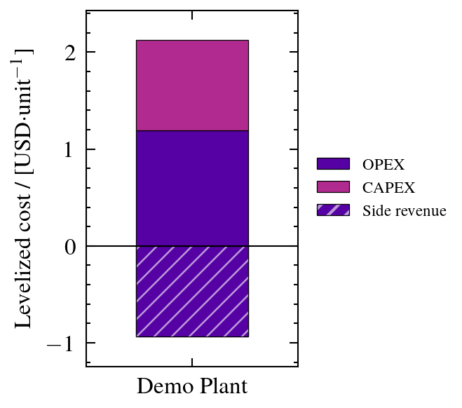
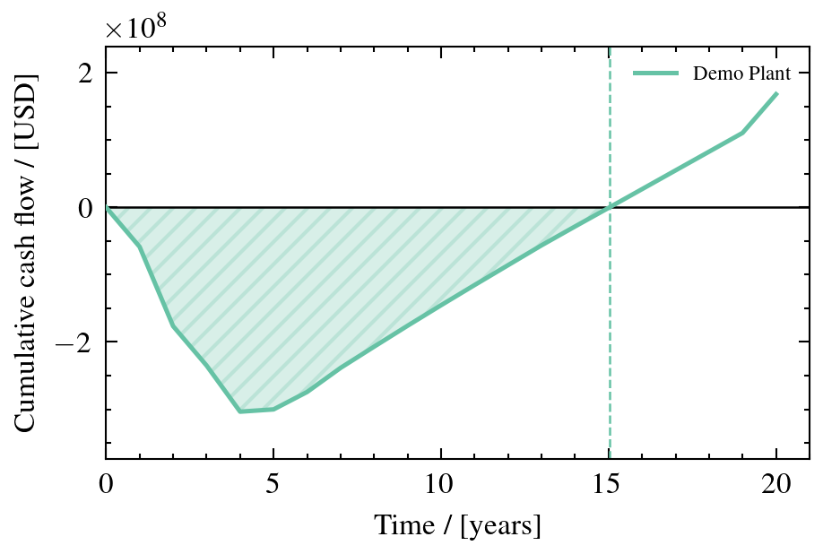
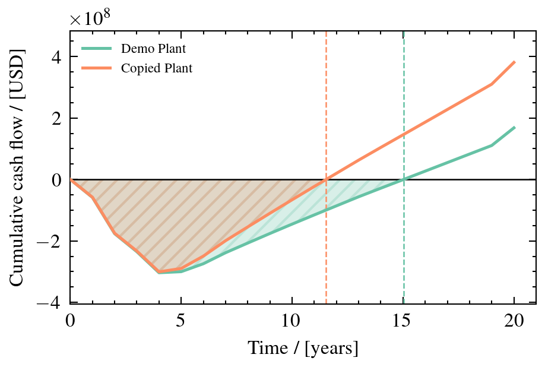
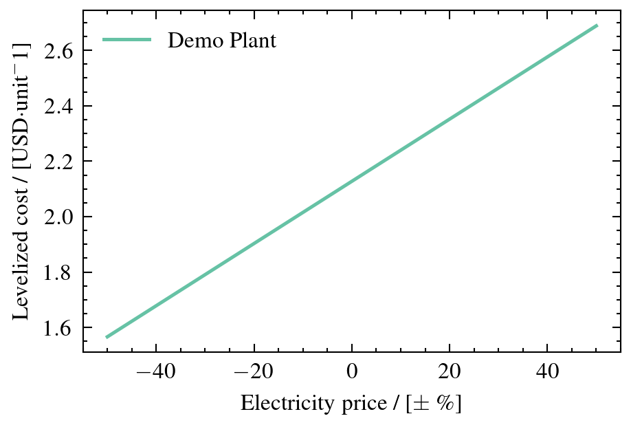
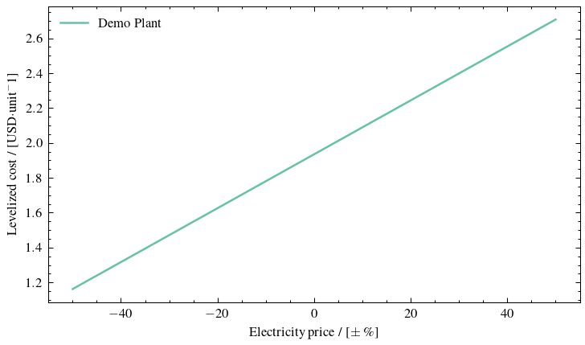
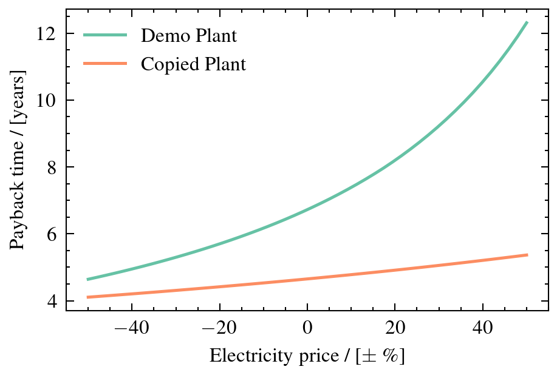
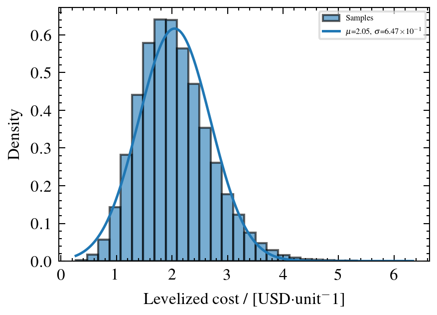
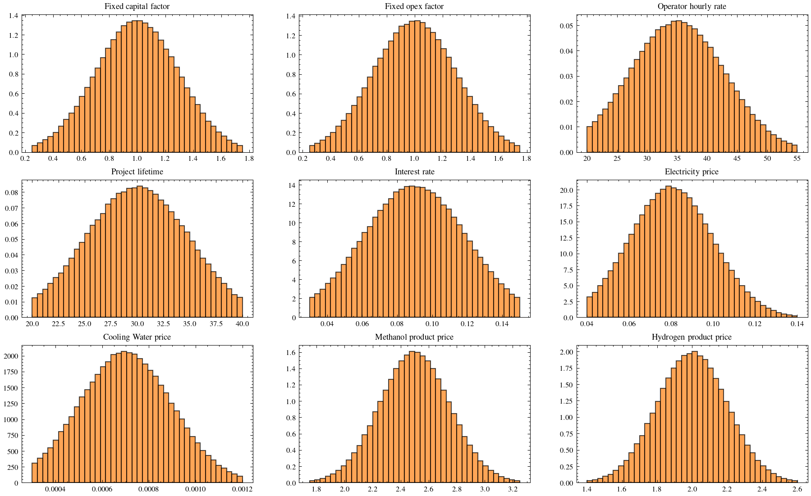
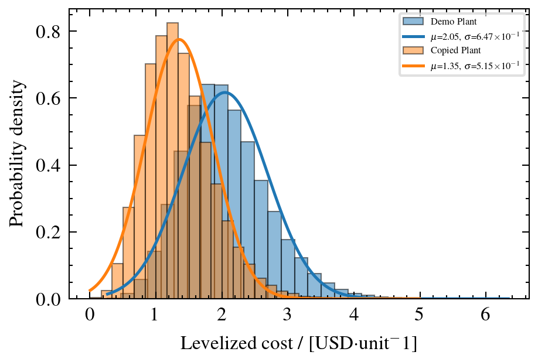
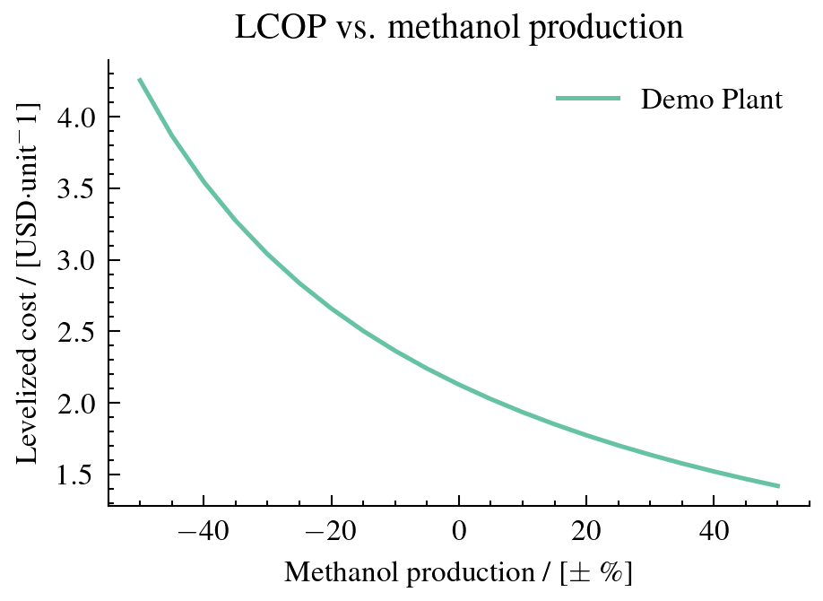

Plotting
========

The :mod:`openpytea.plotting` module wraps matplotlib to produce
publication-quality figures using the `SciencePlots
<https://github.com/garrettj403/SciencePlots>`_ style. All functions return
a ``(fig, ax)`` tuple — a :class:`matplotlib.figure.Figure` and a
:class:`matplotlib.axes.Axes` — so you can further customize or save the
figure directly.

To see the outputs of all code examples below, refer to the
`walkthrough notebook <https://github.com/pbtamarona/OpenPyTEA/blob/main/walkthrough.ipynb>`_.

Cost breakdown charts
---------------------

Stacked bar charts visualize cost structure data returned by the ``*_data``
helper functions in :mod:`openpytea.analysis`.

.. code-block:: python

   from openpytea.analysis import (
       direct_costs_data,
       fixed_capital_data,
       fixed_opex_data,
       variable_opex_data,
   )
   from openpytea.plotting import plot_stacked_bar

   # Equipment-level direct costs
   equip_data = direct_costs_data(plants=plant)
   fig, ax = plot_stacked_bar(equip_data)

   # Capital cost breakdown (ISBL, OSBL, D&E, Contingency)
   capex_data = fixed_capital_data(plants=plant)
   fig, ax = plot_stacked_bar(capex_data)

   # Fixed OPEX breakdown
   fopex_data = fixed_opex_data(plants=plant)
   fig, ax = plot_stacked_bar(fopex_data)

   # Variable OPEX breakdown
   vopex_data = variable_opex_data(plants=plant)
   fig, ax = plot_stacked_bar(vopex_data)

.. list-table::
   :widths: 25 25 25 25

   * - .. image:: ../_static/plotting/direct_costs.png
          :width: 100%
     - .. image:: ../_static/plotting/fixed_capital.png
          :width: 100%
     - .. image:: ../_static/plotting/fixed_opex.png
          :width: 100%
     - .. image:: ../_static/plotting/variable_opex.png
          :width: 100%

Levelized cost breakdown
-------------------------

:func:`~openpytea.analysis.levelized_cost_data` feeds the same
``plot_stacked_bar()`` function, but its "Side revenue" component (stored
as a negative value) is rendered as a waterfall-style base below zero
instead of stacking like a normal cost — so CAPEX and OPEX still stack up
to the true net LCOP at the top of the bar. The side-revenue segment reuses
the color of the largest stacked component, distinguished only by a hatch
pattern, so the CAPEX/OPEX ratio stays easy to read.

.. code-block:: python

   from openpytea.analysis import levelized_cost_data
   from openpytea.plotting import plot_stacked_bar

   lcop = levelized_cost_data(plants=plant)
   fig, ax = plot_stacked_bar(lcop)

Cash flow diagram
-------------------------

:func:`~openpytea.plotting.plot_cash_flow` draws the classic cumulative
cash flow curve: a dip into debt during construction/start-up, a minimum
("maximum investment"), a break-even point where the curve crosses back
above zero, and a climb into profit for the remainder of the project life.
The region where the cumulative cash flow is negative is shaded (hatched)
as debt, and the break-even point (if any) is marked with a dashed
vertical line in the same color as the curve.

.. code-block:: python

   from openpytea.analysis import cash_flow_data
   from openpytea.plotting import plot_cash_flow

   cash_flow = cash_flow_data(plant)
   fig, ax = plot_cash_flow(cash_flow)

   fig.savefig("cash_flow.pdf")

Comparing multiple plants
~~~~~~~~~~~~~~~~~~~~~~~~~

Pass a list of plants to :func:`~openpytea.analysis.cash_flow_data` to
overlay their cumulative cash flow curves — each with its own shaded debt
region and break-even line — for direct comparison:

.. code-block:: python

   cash_flow_multi = cash_flow_data([plant, plant_b])
   fig, ax = plot_cash_flow(cash_flow_multi, figsize=(4.5, 3))

Sensitivity plots
-----------------

.. code-block:: python

   from openpytea.analysis import sensitivity_data
   from openpytea.plotting import plot_sensitivity

   # Vary electricity price ±50 % and plot LCOP
   sens = sensitivity_data(plants=plant, parameter="electricity", plus_minus_value=0.5)
   fig, ax = plot_sensitivity(sens)

   fig.savefig("sensitivity.pdf")

Axis labels and the legend are set automatically from the data returned by
:func:`~openpytea.analysis.sensitivity_data`. Pass a custom ``figsize`` to
resize the chart:

.. code-block:: python

   fig, ax = plot_sensitivity(sens, figsize=(5, 3))

Comparing multiple plants
~~~~~~~~~~~~~~~~~~~~~~~~~

Pass a list of plants to :func:`~openpytea.analysis.sensitivity_data` to
plot all curves on the same axes:

.. code-block:: python

   sens_multi = sensitivity_data(
       plants=[plant, plant_b],
       parameter="electricity",
       metric="NPV",
       plus_minus_value=0.5,
   )
   fig, ax = plot_sensitivity(sens_multi)

Tornado diagrams
----------------

.. code-block:: python

   from openpytea.analysis import tornado_data
   from openpytea.plotting import plot_tornado

   # Default metric is LCOP
   td = tornado_data(plant=plant, plus_minus_value=0.5)
   fig, ax = plot_tornado(td)

   # Profit-oriented metric
   td_roi = tornado_data(plant=plant, plus_minus_value=0.5, metric="ROI")
   fig, ax = plot_tornado(td_roi)

   fig.savefig("tornado.pdf")

.. list-table::
   :widths: 50 50

   * - .. image:: ../_static/plotting/tornado_lcop.png
          :width: 100%
     - .. image:: ../_static/plotting/tornado_roi.png
          :width: 100%

Monte Carlo histograms
-----------------------

.. code-block:: python

   from openpytea.analysis import monte_carlo
   from openpytea.plotting import plot_monte_carlo

   mc_results = monte_carlo(plant, num_samples=1_000_000, batch_size=10_000)

   # Distribution of the LCOP
   fig, ax = plot_monte_carlo(plant, metric="LCOP", bins=30)

   fig.savefig("monte_carlo_lcop.pdf")

Visualizing input distributions
~~~~~~~~~~~~~~~~~~~~~~~~~~~~~~~~~

Use :func:`~openpytea.plotting.plot_monte_carlo_inputs` to verify that the
``std``/``min``/``max`` settings produce the intended input distributions.
Inputs are split into two categories: **process** parameters (consumption
and production quantities) and **economic** parameters (prices, rates, and
the other ``project_uncertainties`` factors). The default ``category="both"``
builds one figure per group and returns both; pass ``category="process"`` or
``category="economic"`` to get just one back as a plain ``(fig, axes)`` pair:

.. code-block:: python

   from openpytea.plotting import plot_monte_carlo_inputs

   fig_process, axes_process, fig_economic, axes_economic = plot_monte_carlo_inputs(
       mc_results, bins=40
   )

   # Or select a single group:
   fig, axes = plot_monte_carlo_inputs(mc_results, category="process", bins=40)

Comparing scenarios
~~~~~~~~~~~~~~~~~~~

.. code-block:: python

   from openpytea.plotting import plot_multiple_monte_carlo

   mc_b = monte_carlo(plant_b, num_samples=1_000_000, batch_size=10_000)

   fig, ax = plot_multiple_monte_carlo(
       data_list=[plant, plant_b],
       metric="LCOP",
       bins=30,
   )

Saving figures
--------------

All functions return a ``(fig, ax)`` tuple. Use ``fig`` directly to save:

.. code-block:: python

   fig, ax = plot_stacked_bar(capex_data)
   fig.savefig("capex.png", dpi=300, bbox_inches="tight")
   fig.savefig("capex.pdf")   # vector format for publications

Customizing axes
-----------------

You can modify the returned axes object with standard matplotlib calls:

.. code-block:: python

   fig, ax = plot_sensitivity(sens)
   ax.set_title("Custom title", fontsize=14)
   ax.set_xlim(-0.6, 0.6)
   ax.legend(loc="upper left")

See also
--------

* :mod:`openpytea.plotting` — full API reference
* :mod:`openpytea.analysis` — data preparation functions
* `Walkthrough notebook <https://github.com/pbtamarona/OpenPyTEA/blob/main/walkthrough.ipynb>`_ — end-to-end worked example
